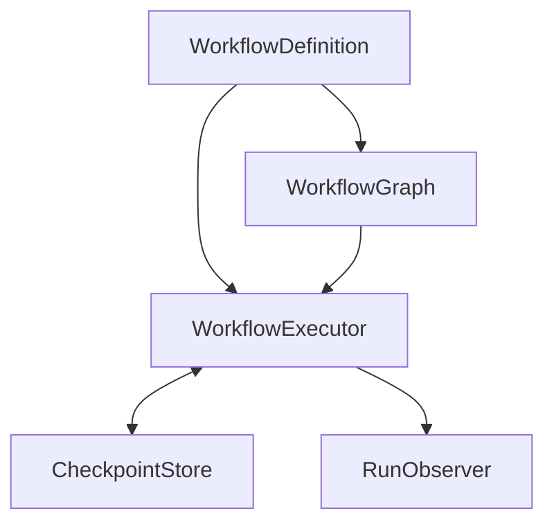

# umio Graph Workflow Design Proposal

- Status: Proposal, not yet implemented
- Baseline: The previously reviewed `Provider → LLM/ModelClient → Tool Loop → Agent → Workflow` architecture
- Goal: Add graph execution, resumption, cancellation, and observability incrementally while preserving the existing sequential `Workflow` API

> This proposal is based on the earlier code review. The latest repository contents could not be rechecked while writing it. Verify concrete type names, constructor signatures, and export paths before implementation.

## 1. Principles and scope

1. **Separate definition from execution.** `WorkflowGraph` is an immutable execution plan; `WorkflowRun` records one execution.
2. **Preserve existing boundaries.** A node may invoke a `ModelClient` or an `Agent`, but the graph engine does not depend on a provider. Agent delegation continues through `agent.asTool()`.
3. **Start with DAGs.** Stabilize branching and parallel joins first. Introduce dynamic loops only with a separately specified execution model.
4. **Separate persistable values from process objects.** Checkpoints contain JSON-compatible inputs, outputs, state, and identifiers. Functions, Agents, and AbortSignals are rebound from the definition and runtime.
5. **Do not promise exactly-once execution.** Nodes with external side effects need idempotency keys or an explicit recovery strategy.

The initial scope includes sequential execution, conditional branches, bounded parallelism, joins, node-level retries, interruption and resumption, and runtime events. Distributed scheduling, arbitrary cyclic graphs, automatic compensating transactions, and a human-approval UI are later work.

## 2. Components

| Component | Responsibility |
| --- | --- |
| `WorkflowDefinition` | Associates the graph with registered node handlers and a deployment version |
| `WorkflowGraph` | Serializable node and edge structure, entry nodes, and join rules |
| `WorkflowExecutor` | Selects ready nodes, limits concurrency, runs nodes, and advances state |
| `WorkflowRun` | Identifies one execution and records its input, status, and node results |
| `CheckpointStore` | Persists versioned run state and coordinates execution leases |
| `RunObserver` | Receives runtime events under an explicit observer-failure policy |
| `ExecutionContext` | Holds internal runtime information; exposes only a narrow `NodeContext` to handlers |



## 3. Draft TypeScript contracts

These are conceptual contracts. Decide the serialization schema and exact integration with existing types during implementation.

```ts
type JsonValue = null | boolean | number | string | JsonValue[] |
  { [key: string]: JsonValue };
type RunStatus = "pending" | "running" | "paused" | "completed" | "failed" | "cancelled";
type NodeStatus = "pending" | "ready" | "running" | "completed" | "skipped" | "failed";

type NodeId = string;
interface WorkflowGraph {
  readonly id: string;
  readonly version: string; // Pin each run to its definition version
  readonly nodes: readonly NodeSpec[];
  readonly edges: readonly EdgeSpec[];
  readonly entry: readonly NodeId[];
}
interface NodeSpec {
  readonly id: NodeId;
  readonly handler: string; // Key in the handler registry
  readonly retry?: RetryPolicy;
  readonly timeoutMs?: number;
  readonly join?: "all" | "any"; // For multiple incoming edges
}
interface EdgeSpec {
  readonly from: NodeId;
  readonly to: NodeId;
  readonly when?: string; // Key for a pure predicate; absent means always active
}
interface RetryPolicy {
  readonly maxAttempts: number; // Includes the first attempt
  readonly initialDelayMs: number;
  readonly maxDelayMs?: number;
  readonly multiplier?: number;
}
interface NodeContext<I extends JsonValue = JsonValue> {
  readonly runId: string;
  readonly nodeId: NodeId;
  readonly attempt: number;
  readonly input: I;
  readonly predecessors: Readonly<Record<NodeId, JsonValue>>;
  readonly signal: AbortSignal;
  readonly deadline?: number;
  readonly idempotencyKey: string;
  emit(event: NodeEvent): void;
}
type NodeHandler = (context: NodeContext) => Promise<JsonValue>;
type EdgePredicate = (output: JsonValue, runInput: JsonValue) => boolean;
interface WorkflowDefinition {
  readonly graph: WorkflowGraph;
  readonly handlers: Readonly<Record<string, NodeHandler>>;
  readonly predicates: Readonly<Record<string, EdgePredicate>>;
}
```

`join: "all"` waits for every **active** incoming path; inactive paths do not block the join. If all incoming paths are inactive, the node becomes `skipped`, and that result propagates downstream. `join: "any"` runs on the first completed active input and does not run again when later inputs arrive. Order multiple predecessor inputs by node ID for deterministic behavior.

```ts
interface NodeRun {
  readonly nodeId: NodeId;
  readonly status: NodeStatus;
  readonly attempt: number;
  readonly output?: JsonValue;
  readonly error?: { code: string; message: string; retryable: boolean };
  readonly startedAt?: string;
  readonly finishedAt?: string;
}
interface WorkflowRun {
  readonly runId: string;
  readonly workflowId: string;
  readonly definitionVersion: string;
  readonly status: RunStatus;
  readonly input: JsonValue;
  readonly nodes: Readonly<Record<NodeId, NodeRun>>;
  readonly revision: number; // Optimistic concurrency control
  readonly createdAt: string;
  readonly updatedAt: string;
}
interface CheckpointStore {
  create(run: WorkflowRun): Promise<void>; // Reject an existing runId
  load(runId: string): Promise<WorkflowRun | undefined>;
  compareAndSwap(run: WorkflowRun, expectedRevision: number): Promise<boolean>;
  acquireLease(runId: string, ownerId: string, ttlMs: number): Promise<boolean>;
  renewLease(runId: string, ownerId: string, ttlMs: number): Promise<boolean>;
  releaseLease(runId: string, ownerId: string): Promise<void>;
}
interface WorkflowExecutor {
  run(definition: WorkflowDefinition, input: JsonValue,
      options?: RunOptions): Promise<WorkflowRun>;
  resume(definition: WorkflowDefinition, runId: string,
         options?: RunOptions): Promise<WorkflowRun>;
  cancel(runId: string): Promise<void>;
}
interface RunOptions {
  readonly runId?: string;
  readonly signal?: AbortSignal;
  readonly maxConcurrency?: number;
  readonly observer?: RunObserver;
}
```

`CheckpointStore` has a different contract from the existing `KVStore`. Keep `KVStore` for data shared among Agents. The checkpoint store must support atomic revision updates and leases. An in-memory implementation is useful for development.

## 4. State transitions and scheduling

- Run: `pending → running → completed | failed | paused | cancelled`, and `paused → running`.
- Node: `pending → ready → running → completed | failed`; an inactive path yields `pending → skipped`.
- Persist a separate `retryAt` for a failed node awaiting another attempt; increment its attempt number before execution starts.
- One executor runs at most `maxConcurrency` nodes concurrently. Sort ready nodes deterministically by graph declaration order and ID.
- Validate the graph before starting: reject duplicate IDs, missing handlers or predicates, nonexistent edge endpoints, cycles, unreachable nodes, and invalid joins.
- Predicates are pure synchronous functions. Evaluate each against a completed predecessor's output once, and checkpoint the decision so resumption never reevaluates it.
- On node success, persist its output and activated edges before making successors ready. Do not start successors if persistence fails.
- On `AbortSignal`, stop scheduling new nodes and signal running nodes to cancel. Once cancellation is acknowledged, persist state and terminate as `cancelled`. A handler that ignores cancellation cannot be forcibly stopped by an AbortSignal; recovery after a lease expires requires an explicit policy.

## 5. Checkpoints, resumption, and side effects

Checkpoint at least before a node starts (`running`, attempt, idempotency key), immediately after success (output and activated edges), when failure or retry is scheduled, and at run termination. `resume` requires the same `workflowId + definitionVersion`, acquires a lease, and skips completed nodes. A node left in `running` has an unknown outcome after a process crash and becomes eligible for recovery or retry.

A process can crash after an external side effect succeeds but before its checkpoint is saved, so execution may be repeated. Give the handler a stable `runId/nodeId` based `idempotencyKey`. When attempts represent the same logical operation, do not include the attempt number in the key. Handlers for payments, file writes, and similar actions must use a target system's idempotency support or query the operation's status. The API must not claim exactly-once execution.

Set size limits and a schema version for persisted inputs and outputs. Store references to large artifacts rather than embedding them. Handlers should return references or redacted values instead of persisting credentials, API keys, or sensitive tool output in checkpoints.

## 6. Failure policy and observability

By default, retry eligible node failures after a delay, then mark the run `failed` when attempts are exhausted. Classify retryable errors by code or an explicit classifier. Use capped exponential backoff with jitter. A timeout aborts the node's signal, but cannot forcibly stop an uncooperative operation.

```ts
type RuntimeEvent =
  | { type: "run-start" | "run-finish"; runId: string; at: string }
  | { type: "node-start" | "node-finish"; runId: string; nodeId: string; attempt: number; at: string }
  | { type: "node-retry"; runId: string; nodeId: string; attempt: number; retryAt: string }
  | { type: "run-pause" | "run-resume" | "run-cancel"; runId: string; at: string };
interface RunObserver { emit(event: RuntimeEvent): void | Promise<void> }
```

Include `runId`, `nodeId`, `attempt`, and timestamp consistently. Attach existing Agent and Tool Loop events as children of the corresponding node event. Persisted run state is the source of truth; observer failures do not fail a run by default. Environments requiring a durable audit trail need an outbox event written in the same transaction as the checkpoint.

## 7. Integration with the existing `Workflow`

Keep the existing sequential `Workflow` public API and event semantics. Internally compile it into a `step-0 → step-1 → …` DAG. Adapt the existing `StepContext` from `NodeContext` and shared state. Existing ADR propagation, Agent invocation, and `agent.asTool()` continue inside node handlers. Translate matching `RunObserver` events for the existing `onEvent` callback. Lock down current results and error behavior with regression tests for callers that do not opt into graph features.

Example:

```ts
const definition: WorkflowDefinition = {
  graph: {
    id: "review", version: "1",
    entry: ["research"],
    nodes: [
      { id: "research", handler: "research" },
      { id: "design", handler: "design" },
      { id: "security", handler: "security" },
      { id: "merge", handler: "merge", join: "all" },
    ],
    edges: [
      { from: "research", to: "design" },
      { from: "research", to: "security" },
      { from: "design", to: "merge" },
      { from: "security", to: "merge" },
    ],
  },
  handlers: { research, design, security, merge },
  predicates: {},
};
await executor.run(definition, { request: "architecture review" });
```

## 8. Implementation order and acceptance criteria

| Phase | Implementation | Acceptance criteria |
| --- | --- | --- |
| 1 | Graph IR, validator, sequential adapter | Existing Workflow results and events remain compatible; reject cycles and missing references |
| 2 | DAG executor, branches, joins, concurrency limit | Run each node once in a diamond graph; skip inactive branches |
| 3 | Run state, checkpoint CAS, in-memory store | Do not start successors after a failed write; detect revision conflicts |
| 4 | Durable store, leases, resume, idempotency key | After a process crash, skip completed nodes and recover uncertain nodes |
| 5 | Retry, timeout, cancellation, observer | Verify attempt counts, delays, cancellation, and event ordering |
| 6 | Pause/approval, loops, other extensions | Add only after specifying their execution semantics and migration rules |

Essential tests cover sequential compatibility, parallel joins, entirely skipped branches, deterministic predicate decisions, crashes immediately after node completion, crashes during a side effect, lease contention, definition-version mismatch, and cancellation propagation. Test executor semantics with fake `ModelClient` instances and handlers without calling provider SDKs; use separate integration tests for Agent wiring.

## 9. Decisions to make before implementation

- Public API names and the required compatibility level for the existing `Workflow` constructor
- Which durable store adapters to provide initially, such as SQLite versus only user-supplied adapters
- Whether `pause` waits for running nodes or signals them to cancel immediately
- Retention and sensitive-data removal policies for node outputs and events
- Whether to support migration of in-progress runs across definition versions; initial recommendation: do not support it

Resolve these details before implementation. Keep graph serializability, atomic state changes, and definition-version pinning as core invariants.